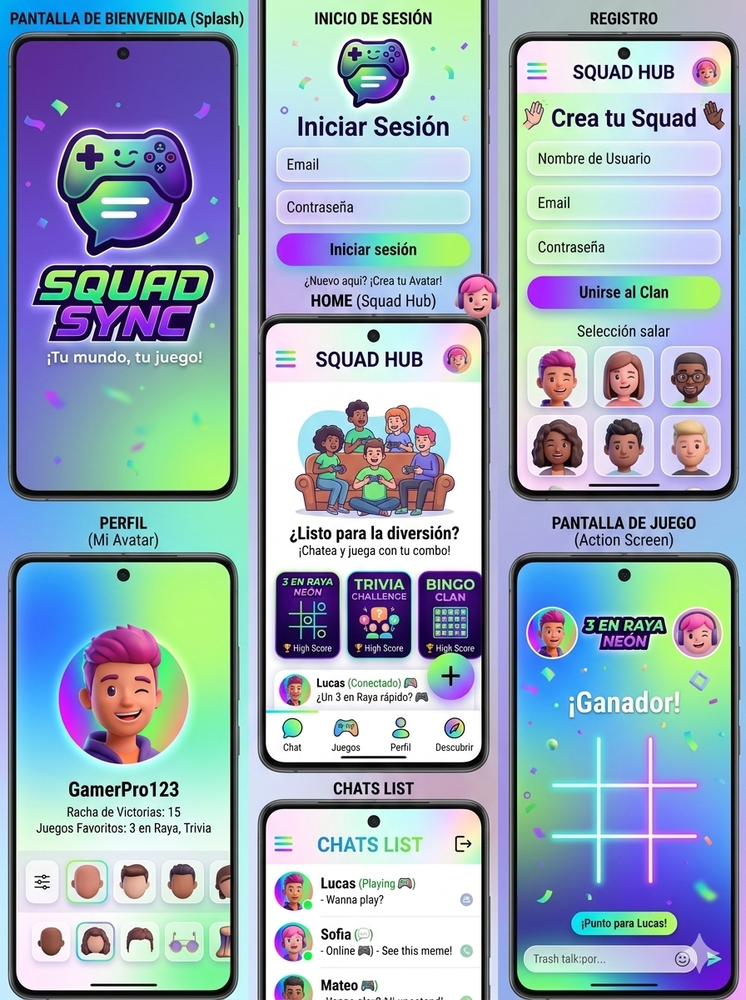
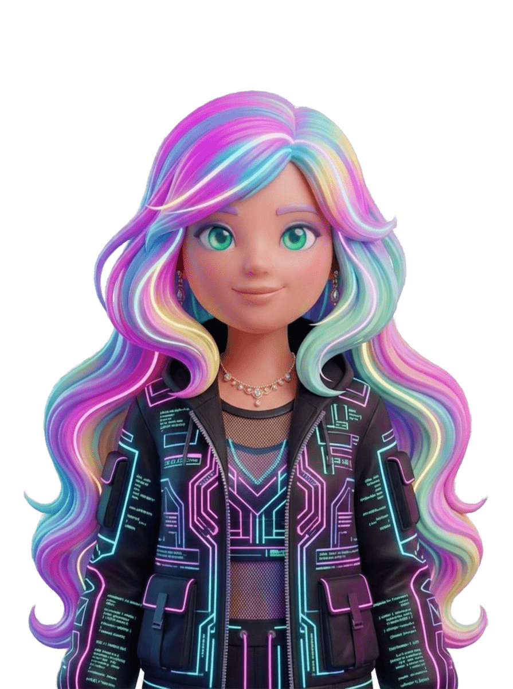
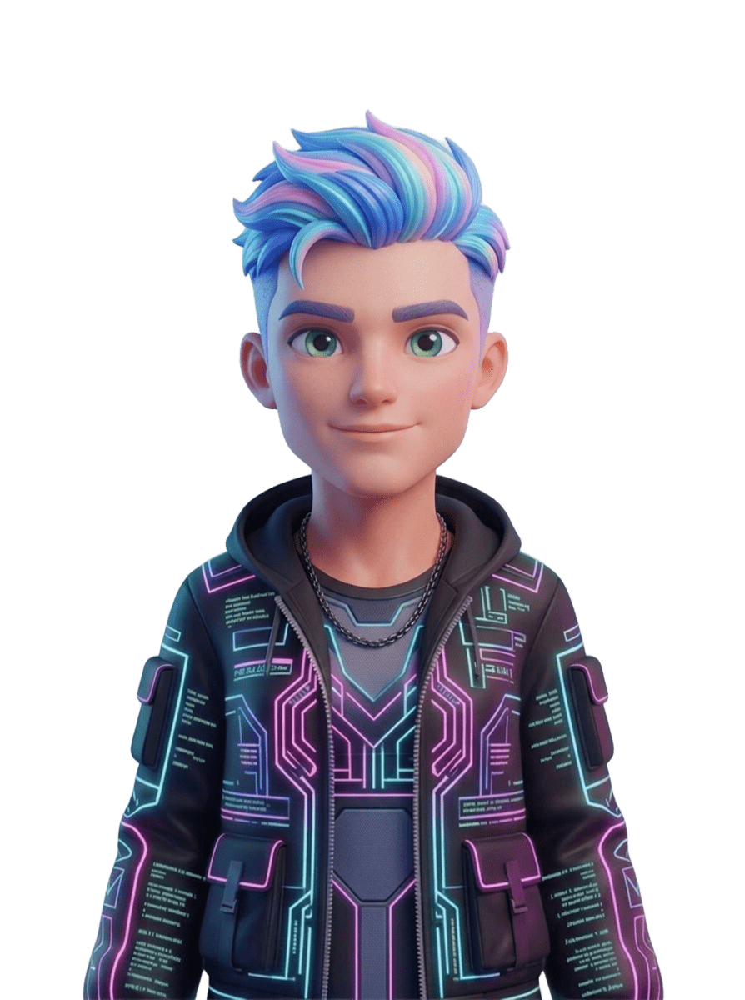
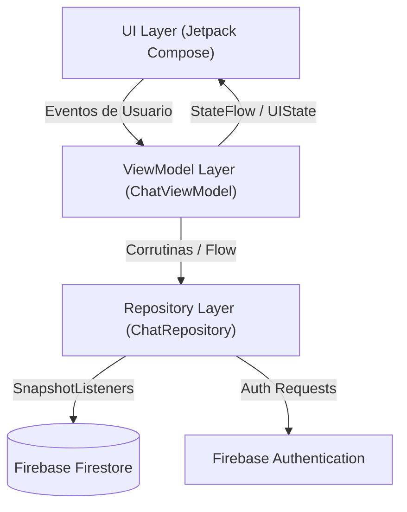

<div align="center">

# 🔮 Glowink - Chat & Play Instantáneo

### *Conecta. Brilla. Juega. ¡Tu combo te espera!*

[](https://developer.android.com)
[](https://kotlinlang.org)
[](https://developer.android.com/jetpack/compose)
[](https://firebase.google.com)

---

</div>

> **Glowink** es una plataforma móvil para comunidades de amigos: mensajería instantánea en
> tiempo real, mini-juegos competitivos, un avatar personalizable, y una interfaz
> Glassmorphic Cyberpunk Neón.

📄 **Documentación completa:** [`docs/MANUAL_USUARIO.md`](docs/MANUAL_USUARIO.md) ·
[`docs/MANUAL_DESARROLLADOR.md`](docs/MANUAL_DESARROLLADOR.md) ·
[`docs/CHANGELOG.md`](docs/CHANGELOG.md) · [`docs/FIRESTORE_SCHEMA.md`](docs/FIRESTORE_SCHEMA.md)

## Referencia visual






*(Ilustraciones de referencia usadas para definir la paleta y el estilo; el avatar dentro de
la app se dibuja con un motor vectorial propio — ver sección de Avatar más abajo. El ícono
de la app es un diseño propio — burbuja de chat + rayo — ver `docs/MANUAL_DESARROLLADOR.md`
sección 8.)*

## 🎨 Identidad Visual

| Token / Color | Código Hex | Aplicación en la Interfaz |
| :--- | :---: | :--- |
| **Púrpura Ultravioleta** | `#7B2CBF` | Identidad de marca, acentos primarios, degradados. |
| **Verde Lima Neón** | `#39FF14` | Estado "en partida", fichas "X", GlowCoins. |
| **Azul Cian Eléctrico** | `#00F0FF` | Estado "disponible", fichas "O", bordes glassmórficos. |
| **Fondo Obsidian** | `#0A0714` | Fondo oscuro de toda la app. |

### 🪟 Efecto Glassmorphic
`Modifier.glassmorphic()` (en `ui/theme/Glassmorphism.kt`) aplica translucidez con
degradado, borde neón configurable (color o `Brush`), y — desde esta actualización — un
fondo diferenciado por contexto (`GlassBubbleSelfGradient` / `GlassBubbleOtherGradient` para
las burbujas de chat, con el contraste corregido; ver `docs/CHANGELOG.md` sección 1.1).

## 🚀 Características

### 🎭 1. Avatar personalizable (vectorial, 100% funcional)
Editor con vista previa en vivo usando las capas gráficas reales incluidas en
`res/drawable`: silueta, peinado, color de cabello, ropa y calzado. Las capas se mantienen
alineadas mediante un lienzo común y `ContentScale.Fit`; el cabello usa una escala controlada
para no cubrir el personaje. El avatar guardado se persiste en Firestore y se reutiliza en
Perfil, chats y listas. Detalle técnico y justificación de este enfoque en el manual del
desarrollador.

### 🔐 2. Autenticación reactiva
Firebase Authentication con checklist de fuerza de contraseña en tiempo real (6+
caracteres, número, mayúscula) y creación automática del perfil en Firestore.

### 💬 3. Glow Hub, Chat en tiempo real y 3 en Raya Neón
Historias efímeras con anillos animados, burbujas de chat con contraste corregido, y
partidas de Tres en Raya sincronizadas en vivo vía Firestore.

### 📸 4. Cámara real con filtros
CameraX con vista previa en vivo, cambio de cámara frontal/trasera funcional, y captura
real de fotos (`ImageCapture`) con 5 filtros temáticos y stickers. Al publicar, la foto se
sube de verdad a Firebase Storage.

### 🎮 5. Glow Arena — 4 minijuegos nuevos y originales
- **🐍 Culebra Glow** — serpiente clásica con power-ups propios ("Prismas Glow").
- **⚡ Duelo Relámpago** — duelo de reflejos a 2 jugadores en un mismo teléfono.
- **🏁 Carrera Glow** — carrera de fichas con capturas y casillas seguras, sobre un circuito
  ovalado propio.
- **🧠 Cyber Quiz** — trivia original de cultura gamer y tecnología.

Cada uno otorga GlowCoins reales y guarda sus estadísticas en Firestore; el desbloqueo de
cada juego depende de las monedas reales del usuario (ver `docs/FIRESTORE_SCHEMA.md`).
Ajedrez Glow (♟️) queda como próxima incorporación.

### 🧊 6. Visor 3D
Muestra archivos `.glb` (por ejemplo, exportados de Tripo3D) con el componente
`<model-viewer>`, cámara inicial de frente y rotación libre. Ver
`app/src/main/assets/models/LEEME.md` para instrucciones y limitaciones.

### 🧭 7. Descubrir
Feed de comunidades activas dentro de Glowink.

---

## 🔥 Configuración de Firebase

El proyecto incluye `firestore.rules`, `storage.rules` y `firebase.json` para documentar y
facilitar el despliegue de las reglas. En Firebase Console verifica que estén habilitados:

1. **Authentication → Sign-in method → Email/Password**.
2. **Firestore Database**.
3. **Storage**.
4. Publica las reglas incluidas antes de probar chats, juegos o historias.

Las reglas exigen autenticación y restringen los chats a los dos UID incluidos en el ID
canónico de la conversación. La aplicación ya no intenta leer `users_glowink` antes de que
exista una sesión válida.

---

## ⚙️ Arquitectura de Software



**Single Source of Truth:** la interfaz consume estados inmutables expuestos vía
`StateFlow` a través de `.collectAsState()`.

### 🛠️ Stack de Tecnologías

| Componente | Tecnología |
| :--- | :--- |
| **Lenguaje** | Kotlin |
| **UI Framework** | Jetpack Compose · Material 3 |
| **Navegación** | Navigation-Compose |
| **Autenticación** | Firebase Auth |
| **Base de Datos** | Cloud Firestore (tiempo real) |
| **Almacenamiento** | Firebase Storage (fotos de la Cámara) |
| **Cámara** | CameraX (`Preview` + `ImageCapture`) |
| **Avatar** | Motor de dibujo vectorial propio (`Canvas`) |
| **Visor 3D** | WebView + `<model-viewer>` |

---

## 📂 Estructura del Proyecto

```text
com.example.glowink/
├── data/
│   ├── Models.kt              # User, Avatar3DConfig, GameStats, Message, GlowStory, GameState
│   └── ChatRepository.kt      # Firebase Firestore + Auth
│
├── ui/
│   ├── avatar/                # Catálogo, motor de dibujo y editor del Avatar
│   ├── games/                 # Culebra Glow, Duelo Relámpago, Carrera Glow
│   ├── navigation/GlowinkNavigation.kt
│   ├── screens/                # Auth, ChatsList, Chat, Camera, Profile, Games, Discover, Visor 3D...
│   ├── theme/                  # Colores, tipografía, glassmorphism, íconos vectoriales propios
│   └── viewmodel/ChatViewModels.kt
│
├── assets/models/              # Coloca aquí tus .glb para el Visor 3D
└── MainActivity.kt
```

---

## 📲 Instrucciones de Instalación

### Requisitos Previos
- Android Studio (versión reciente) y JDK 17.
- Dispositivo o emulador con Android 7.0 (API 24) o superior.

### Pasos
1. **Clonar el repositorio** y abrirlo en Android Studio.
2. **Configurar Firebase:** coloca tu `google-services.json` en `/app/`. Si vas a subir el
   proyecto a un repositorio, revisa primero `docs/MANUAL_DESARROLLADOR.md` sección
   "Seguridad y credenciales" — hay una API key que debe rotarse antes de publicar.
3. **Sincronizar:** `File → Sync Project with Gradle Files`.
4. **Ejecutar:** selecciona tu dispositivo/emulador y presiona *Run*, o:
   ```bash
   ./gradlew assembleDebug
   ```

---

## 🎓 Acreditación Académica - SENA ADSO

Este proyecto se desarrolla como evidencia de aprendizaje para el programa **Análisis y
Desarrollo de Software (ADSO)** del **SENA**.

---

<div align="center">

**Glowink Team © 2026** — *Conecta. Brilla. Juega.*

</div>
